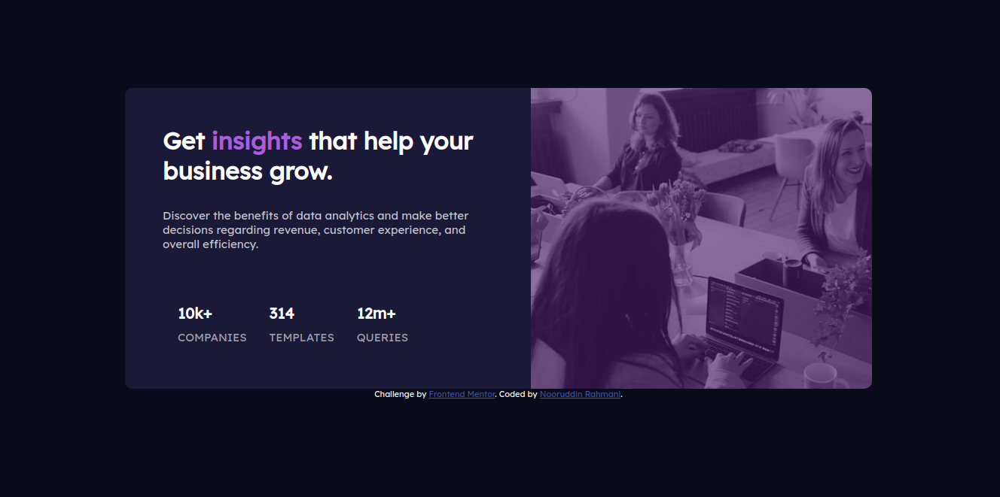

# Frontend Mentor - Stats preview card component solution
## Table of contents

- [Overview](#overview)
  - [The challenge](#the-challenge)
  - [Screenshot](#screenshot)
  - [Links](#links)
- [My process](#my-process)
  - [Built with](#built-with)
  - [Useful resources](#useful-resources)
- [Author](#author)

## Overview

### The challenge

Users should be able to:

- View the optimal layout depending on their device's screen size

### Screenshot

### Links

- Solution URL: [frontend mentor](https://www.frontendmentor.io/challenges/stats-preview-card-component-8JqbgoU62)
- Live Site URL: [netlify](https://stats-preview-card-component-card.netlify.app/)

## My process

### Built with

- Semantic HTML5 markup
- CSS custom properties
- Flexbox
- CSS Grid
- Mobile-first workflow
### Useful resources

- [Youtube](https://www.youtube.com) - Many people have already completed the challenge.
## Author

- Website - [Add your name here](https://www.your-site.com)
- Frontend Mentor - [@nooruddin-rahmani](https://www.frontendmentor.io/profile/nooruddin-rahmani)
- Twitter - [@Noorudd79181763](https://twitter.com/Noorudd79181763)
